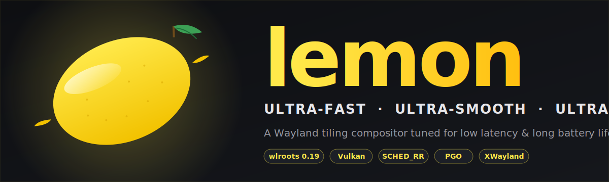

<div align="center">



# 🍋 Lemon

**A Wayland tiling compositor tuned for the lowest input latency, the smoothest animations and the longest battery life on Linux.**

[](LICENSE.dwm)
[](https://gitlab.freedesktop.org/wlroots/wlroots)
[](https://www.khronos.org/vulkan/)
[](#-install)

[**Install**](#-install) · [**Why Lemon?**](#-why-lemon) · [**Features**](#-features) · [**Configure**](#-configure) · [**IPC**](#-ipc--mmsg)

</div>

---

## ⚡ Why Lemon?

Lemon is a fork of [mangowm](https://github.com/DreamMaoMao/mangowm) (itself derived from `dwl`) built around one obsession: **make the desktop feel instant**. Every design choice is graded against frametime *p99*, not average FPS.

| Goal | How Lemon achieves it |
|---|---|
| **🎯 Lowest input latency** | `SCHED_RR` real-time priority + `mlockall` working-set pin + 4 Hz idle-notify throttle + hot input handlers + `setpriority(-10)` fallback |
| **🪶 Long battery life** | Auto-detect AC/battery via `/sys/class/power_supply`, cap animations at 60 Hz on battery, per-monitor wakeups, lazy redraw when nothing's dirty, no blur, no shadow |
| **🚀 Instant app launches** | `posix_spawn` (no fork-COW), pre-loaded cursor theme, warm-pinged xdg-desktop-portal, persistent `app_id → geometry` cache |
| **💎 Smooth animations** | Per-monitor render loop, per-client wake-ups, focus-aware tiering (FOCUS / VISIBLE / OCCLUDED / HIDDEN), tag-transition slide-in/out |
| **🔥 Modern GPU pipeline** | Vanilla wlroots scene tree on top of **Vulkan** (or GLES2 fallback) — no scenefx pinning |
| **🪐 Tight binary** | Single-TU C build with LTO + opportunistic GCC IPA + optional 2-pass PGO + jemalloc |

---

## ✨ Features

<table>
<tr>
<td width="50%" valign="top">

### 🪟 Layouts & windowing
- Per-tag layouts: **scroller**, master-stack, monocle, grid, deck, dwindle, horizontal, vertical
- Tags (not workspaces) — multiple tags visible at once
- Floating, fullscreen, maximize, **minimize**, scratchpads (Sway-style & named), overlay, swallow
- Drag tile-to-tile rearrangement
- Multi-monitor with independent refresh rates

</td>
<td width="50%" valign="top">

### 🎨 Visuals
- Buttery geometry animations (open / close / move / tag / focus)
- Per-tag animation curves & durations
- **Plain coloured borders** with smooth colour transitions
- VRR-aware presentation, optional tearing-control for games
- Configurable cursor theme, hotcorners, overview mode

</td>
</tr>
<tr>
<td width="50%" valign="top">

### ⚙️ Plumbing
- **XWayland** first-class support
- `dwl-ipc-unstable-v2` server + `mmsg` CLI for status bars & scripts
- Hot-reload single-file config (`~/.config/lemon/lemon.conf`)
- text-input v2 / v3 (Fcitx5, IBus)
- Idle inhibit, session lock, foreign-toplevel

</td>
<td width="50%" valign="top">

### 🛠️ Engineered for speed
- **PCRE2 JIT** for window/layer rules
- Inlined frame-clock cache (1× `clock_gettime` / frame)
- `LEMON_HOT` / `LEMON_COLD` / `LEMON_LIKELY` annotations on hot paths
- glibc `mallopt` trim + 10 s periodic `malloc_trim`
- Lazy scene-rect allocation (droparea, splitindicator)

</td>
</tr>
</table>

---

## 📦 Install

### Runtime dependencies

```
wayland         wayland-protocols   libinput
libdrm          libxkbcommon        pixman
libdisplay-info libliftoff          hwdata
seatd           pcre2               xorg-xwayland
libxcb          xcb-icccm           wlroots 0.19
```

GPU (pick one):
```bash
# AMD
sudo pacman -S vulkan-radeon
# Intel
sudo pacman -S vulkan-intel
# NVIDIA
sudo pacman -S nvidia-utils
```

### Quick install

```bash
meson setup build --buildtype=release -Dprefix=/usr -Dnative=true -Dlto=true -Djemalloc=true
ninja -C build
sudo ninja -C build install
```

### Maximum performance — PGO two-pass

```bash
# Pass 1: instrumented build
meson setup build-pgo --buildtype=release -Dprefix=/usr \
  -Dnative=true -Dlto=true -Djemalloc=true -Dpgo=generate
ninja -C build-pgo

# Run lemon 5-10 min with your typical workload, exit cleanly
build-pgo/lemon

# Pass 2: consume the gathered profile
meson configure build-pgo -Dpgo=use
ninja -C build-pgo
sudo ninja -C build-pgo install
```

### Unlock real-time scheduling (recommended)

```bash
sudo tee /etc/security/limits.d/lemon.conf <<'EOF'
@video - rtprio 10
@video - memlock 524288
EOF
sudo usermod -aG video $USER
# log out / log in to apply
```

Without this, Lemon falls back to `nice -10` automatically — input still feels great, just not the absolute best.

### Build flags

| Option | Effect |
|---|---|
| `-Dnative=true` | `-march=native -mtune=native` |
| `-Dlto=true` | `-flto=thin` link-time optimisation *(on by default)* |
| `-Djemalloc=true` | Link against jemalloc (lower fragmentation) |
| `-Dpgo=generate` | First pass: instrument |
| `-Dpgo=use` | Second pass: consume profile |
| `-Dpgo_dir=PATH` | Override PGO profile directory |
| `-Dasan=true` | AddressSanitizer for debugging |
| `--buildtype=debug` | `-O0 -g`, skips release flags |

---

## 🚀 First run

```bash
mkdir -p ~/.config/lemon
cp /etc/lemon/lemon.conf ~/.config/lemon/lemon.conf
lemon
```

Or with an explicit config:

```bash
lemon -c /path/to/lemon.conf
```

### Default key bindings

| Keys | Action |
|---|---|
| `Alt`+`Return` | Terminal (`foot`) |
| `Alt`+`Space` | Launcher (`rofi`) |
| `Alt`+`Q` | Kill focused client |
| `Super`+`F` | Toggle fullscreen |
| `Alt`+`T` | Toggle floating |
| `Alt`+arrows | Move focus |
| `Ctrl`+`1..9` | Switch to tag |
| `Alt`+`1..9` | Move client to tag |
| `Super`+`M` | Quit Lemon |

Full reference: [`docs/bindings/keys.md`](docs/bindings/keys.md).

---

## ⚙️ Configure

Single file at `~/.config/lemon/lemon.conf`. Edits take effect without restarting the compositor.

The annotated example shipped in [`assets/lemon.conf`](assets/lemon.conf) is the canonical reference for every option.

Topic guides:

- [`docs/configuration/`](docs/configuration/) — basics, input, monitors, portals
- [`docs/window-management/`](docs/window-management/) — layouts, rules, scratchpads
- [`docs/visuals/`](docs/visuals/) — animations, theming, status bar
- [`docs/bindings/`](docs/bindings/) — keys & mouse gestures

---

## 📡 IPC — `mmsg`

`mmsg` is a small CLI that speaks the `dwl-ipc-unstable-v2` protocol. It can read state (tags, layout, focused client, monitor info), watch events as a stream, and dispatch internal commands.

```bash
mmsg -g -t          # current tags
mmsg -s -t 2+       # add tag 2 to current view
mmsg -w -Oct        # watch outputs / clients / tags
mmsg -d killclient  # dispatch a command
```

Full reference: [`docs/ipc.md`](docs/ipc.md).

---

## 🧪 Project layout

```
src/lemon.c              main compositor — single TU including all headers below
src/common/util.{c,h}    helpers: die, ecalloc, regex JIT cache, frame clock, strings
src/common/surface_cache.h  persistent app_id → geometry cache
src/config/              parser + default values for lemon.conf
src/client/              Client struct + ops
src/layout/              tiling algorithms (one header per layout)
src/animation/           keyframe interpolation per object kind
src/fetch/               read-only queries (clients, monitors)
src/dispatch/            keybinding action table
src/ext-protocol/        extra Wayland protocols
mmsg/mmsg.c              IPC CLI client
protocols/               XML protocol definitions for wayland-scanner
assets/                  desktop entry, portal config, example lemon.conf, banner
docs/                    documentation
```

Most files under `src/*/` are `.h` headers that contain function definitions and are included once from `src/lemon.c`. This is intentional — the project compiles as a single translation unit for fast builds and aggressive whole-program optimisation.

The architecture roadmap is documented in [`docs/architecture-nextgen.md`](docs/architecture-nextgen.md): nine subsystems graded by frametime *p99*, with the current implementation status of each.

---

## 🤝 Credits

- [wlroots](https://gitlab.freedesktop.org/wlroots/wlroots) — Wayland protocol implementation
- [dwl](https://codeberg.org/dwl/dwl) — base compositor
- [mangowm](https://github.com/DreamMaoMao/mangowm) — direct upstream
- [mwc](https://github.com/nikoloc/mwc) — animation reference
- [sway](https://github.com/swaywm/sway) — reference compositor

---

## 📄 License

See [`LICENSE.dwm`](LICENSE.dwm) for the original dwm/dwl portions and the source headers for upstream attribution.

<div align="center">

— Built with 🍋 and a stopwatch —

</div>
